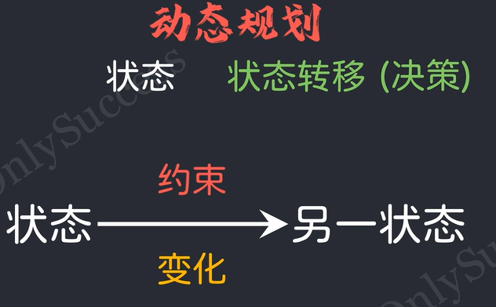

# 算法概念笔记

## 动态规划

视频参考链接：【不是我催... 以后大家学动态规划，都得要看这个视频。】 https://www.bilibili.com/video/BV1m9EUzLEB4/?share_source=copy_web&vd_source=1faf6f8be863497a8aa161f8493e14d2

从起点出发，经过一系列的行进路线，到达终点求最优值、方案数、概率。

从**初始状态**出发，经过一系列的**状态转移**，到达目标状态，求最优值、方案数、概率。

状态转移

1. 状态转移必须有方向，且整体不能成环
2. 状态的个数需要在可接受范围内。

动态规划就是一种空间换时间的算法。

### 三要素

- 最优子结构

  如果问题的最优解所包含的子问题的解也是最优的，就称该问题具有最优子结构。
  也就是说一个问题的最优解只取决于其子问题的最优解。

- 无后效性

  将原问题分解为若干个子问题，每个子问题的求解过程作为一个阶段。
  当前阶段的求解只与之前阶段有关，与之后阶段无关，即某阶段的状态一旦确定，就不受这个状态后续决策的影响。

- 重叠子问题

  求解过程中每次产生的子问题并不总是新问题，有大量子问题重复。
  在遇到重复子问题时，只需要在表格中查询，无需再次求解。